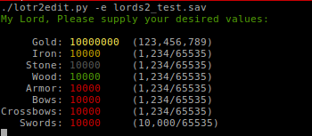

Lords of the Realm II - Game file editor
========================================

A game file editor that is written in python.  This program will allow you to edit Gold, Stone, Wood, Iron and weapons (Armor, Swords, Bows and crossbows).

Many years ago I wrote the same thing in Turbo Pascal and would even allow you to edit individual counties but I lost the source for this and so wrote it again in Python.

This program is tested on Linux and Windows.

Usage
=====

**python lotr2edit.py -h**
Will show the help page

**python lotr2edit.py -l <gamfile.sav>**
Will list the current values of the savegame file.

**python lotr2edit.py -e <gamfile.sav>**
Will allow you to edit the savegame file and update various values.

**python lotr2edit.py -s <gamfile.sav>**
This option will just set the savegame file to good defaults so no editing is required.

License
=========

Copyright 2012 Nigel Heaney
 
This program is free software; you can redistribute it and/or modify
it under the terms of the GNU General Public License as published by
the Free Software Foundation; either version 2 of the License, or
(at your option) any later version.
  
This program is distributed in the hope that it will be useful,
but WITHOUT ANY WARRANTY; without even the implied warranty of
MERCHANTABILITY or FITNESS FOR A PARTICULAR PURPOSE.  See the
GNU General Public License for more details.
  
You should have received a copy of the GNU General Public License
along with this program; if not, write to the Free Software
Foundation, Inc., 51 Franklin Street, Fifth Floor, Boston,
MA 02110-1301, USA.
